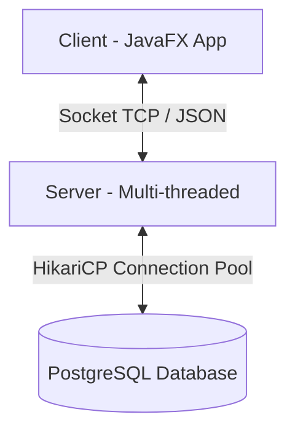

# 🔨 BidNow - Hệ Thống Đấu Giá Trực Tuyến Premium

**BidNow** là một nền tảng đấu giá trực tuyến hoàn chỉnh được thiết kế theo kiến trúc Client-Server mạnh mẽ. Ứng dụng client sở hữu giao diện desktop hiện đại được phát triển bằng **JavaFX 21** kết hợp thiết kế Dark Mode tối giản, sang trọng (Glassmorphism), mang lại trải nghiệm chuyên nghiệp và trực quan cho người dùng.

---

## 📸 Điểm Cải Tiến Gần Đây
* **Tối ưu hóa khung "Phiên Đang Chạy" (Live Sessions):** Thu nhỏ kích thước thẻ (card) phiên đấu giá trực tiếp trên Dashboard của Bidder bằng cách cân chỉnh padding, khoảng cách các chỉ số (Current Bid, Start Price, Total Bids) và cỡ chữ. Giúp tăng khả năng hiển thị đồng thời nhiều phiên đấu giá hơn, tránh tình trạng giao diện bị cắt ngang hay tràn màn hình, đảm bảo tính thẩm mỹ cao chuẩn chuyên nghiệp.

---

## 🛠️ Công Nghệ Sử Dụng (Technology Stack)

* **Core Language:** Java 21 (LTS)
* **User Interface:** JavaFX 21, FXML & Custom Vanilla CSS (Modern Dark Theme)
* **Database:** PostgreSQL (Lưu trữ lịch sử đấu giá, tài khoản, số dư, sản phẩm...)
* **Connection Pool:** HikariCP 5.1.0 (Quản lý kết nối DB hiệu năng cao)
* **Data Serialization:** Google Gson 2.10.1 (Trao đổi dữ liệu Client-Server thông qua JSON)
* **Security:** jBCrypt 0.4 (Mã hóa mật khẩu an toàn)
* **Utilities:** Project Lombok (Giảm thiểu boilerplate code), JUnit 5 (Kiểm thử đơn vị)
* **Build Tool:** Maven

---

## 🏗️ Kiến Trúc Hệ Thống (Architecture Overview)

Hệ thống được chia thành 3 phân vùng chính tạo tính mô-đun cao và dễ bảo trì:



### 1. Phân vùng Client (`Client.*`)
Đảm nhận vai trò hiển thị giao diện người dùng và tương tác trực tiếp với các luồng sự kiện socket.
* **`Client.Launcher`:** Điểm khởi chạy ứng dụng Client.
* **`Client.Controller`:** Chứa toàn bộ JavaFX Controllers quản lý hành vi các màn hình (Đăng ký, Đăng nhập, Dashboard, Sàn đấu giá, Lịch sử đặt giá, Winner).
* **`Client.net`:** Bộ xử lý kết nối socket gửi/nhận gói tin TCP thời gian thực từ Server.
* **`Client.service`:** Cung cấp các dịch vụ nội bộ phía client.

### 2. Phân vùng Server (`Server.*`)
Trực tiếp thực hiện các nghiệp vụ tính toán, xử lý tranh chấp đặt cọc, giám sát thời gian kết thúc phiên và quản lý tự động đặt giá (Auto-Bid).
* **`Server.Launcher`:** Điểm khởi chạy ứng dụng Socket Server.
* **`Server.Controller`:** Điều phối dữ liệu gửi đi và phản hồi yêu cầu client (Dashboard, Moderation, Auction Engine).
* **`Server.net`:** Quản lý đa luồng kết nối client (Multi-threaded Client Socket Handler).
* **`Server.service`:** Lớp xử lý dịch vụ chính:
  * `AutoBidService`: Hệ thống tự động đặt giá theo thuật toán tối ưu.
  * `UserService` / `ProductService` / `SessionService`: Nghiệp vụ cốt lõi.

### 3. Phân vùng Dùng Chung (`Common.*`)
Chứa các lớp cấu trúc dùng chung giữa cả Client và Server để tránh dư thừa mã nguồn.
* **`Common.DataBase`:** Cấu hình nguồn dữ liệu PostgreSQL, các lớp Repository hỗ trợ Query/Update.
* **`Common.Model`:** Thực thể dữ liệu ánh xạ từ DB (`User`, `Product`, `AuctionSession`, `BidHistory`, `Stake`...).
* **`Common.Enum`:** Định nghĩa các trạng thái (`SessionStatus`, `UserRole`, `ProductStatus`).
* **`Common.util`:** Công cụ tiện ích (Mã hóa BCrypt, Gson parser).

---

## 🌟 Tính Năng Nổi Bật

### 1. Phân Quyền Người Dùng Hoàn Chỉnh (Multi-role)
* **Người đấu giá (Bidder):**
  * Theo dõi bảng điều khiển trực quan: Số dư khả dụng, tiền đang khóa, số phiên dẫn đầu.
  * Tham gia sàn đấu giá trực tuyến, đặt giá nhanh hoặc thiết lập **Auto-Bid** thông minh.
  * Nạp tiền tài khoản mô phỏng, xem chi tiết lịch sử thắng cuộc.
* **Người bán (Seller):**
  * Đăng bán sản phẩm, theo dõi tình trạng duyệt sản phẩm từ Admin.
  * Quản lý danh sách phiên đấu giá thuộc sở hữu của mình.
* **Quản trị viên (Admin):**
  * Duyệt sản phẩm đăng bán từ người dùng.
  * Giám sát hệ thống đấu giá toàn cục.

### 2. Sàn Đấu Giá Thời Gian Thực (Real-time Market Floor)
* Cập nhật tức thời giá thầu hiện tại của toàn sàn không cần tải lại trang.
* Bộ đếm ngược thời gian (Countdown Timer) chính xác đến từng giây.
* Hệ thống khóa tiền cọc tự động bảo vệ giao dịch công bằng giữa bên mua và bên bán.

---

## 📁 Cấu Trúc File Giao Diện FXML (`src/main/resources/com/template/hellfx/`)

* 🔐 **`UILogin.fxml` / `UIRegister.fxml`:** Màn hình Đăng nhập & Đăng ký sang trọng.
* 📊 **`dashboard-Bidder.fxml`:** Bảng điều khiển người đấu giá (Đã được tối ưu thẻ Live Sessions).
* 🛒 **`danhSachDauGia.fxml` / `session-detail.fxml`:** Giao diện chi tiết phiên đấu giá trực tuyến.
* 💳 **`Deposit.fxml` / `account.fxml`:** Giao diện nạp tiền và xem số dư chi tiết.
* 🏆 **`Winner.fxml`:** Hiển thị vinh danh người chiến thắng phiên đấu giá.
* 🛡️ **`dashboard - Admin.fxml` / `PendingItems.fxml` / `AdminItemManagement.fxml`:** Không gian quản lý của Admin.
* 📦 **`dashboard - Seller.fxml` / `SellerProducts.fxml`:** Không gian quản lý của Seller.
* 🎨 **`bidnow-dark.css`:** Tập tin định nghĩa giao diện Dark Theme cốt lõi của hệ thống.

---

## 🚀 Hướng Dẫn Cài Đặt và Chạy Ứng Dụng

### 1. Yêu Cầu Hệ Thống
* Java JDK 21 trở lên.
* Cơ sở dữ liệu PostgreSQL đã được cài đặt và đang chạy.
* Maven 3.8+.

### 2. Thiết Lập Cơ Sở Dữ Liệu
1. Tạo một cơ sở dữ liệu PostgreSQL mới.
2. Cập nhật cấu hình kết nối DB (Host, Port, DB Name, Username, Password) trong file mã nguồn kết nối của `Common.DataBase`.

### 3. Biên Dịch và Chạy Hệ Thống

#### Bước 1: Khởi Chạy Server
Mở terminal tại thư mục gốc dự án và chạy lệnh sau để khởi động Server lắng nghe kết nối:
```bash
mvn exec:java -Dexec.mainClass="Server.Launcher"
```

#### Bước 2: Khởi Chạy Client
Mở một cửa sổ terminal mới và khởi động ứng dụng giao diện người dùng (Client):
```bash
mvn javafx:run
```

---

## 🛡️ Đảm Bảo Chất Lượng và Thẩm Mỹ
* Giao diện BidNow cam kết không dùng placeholders sơ sài. Mọi chi tiết thiết kế đều được tính toán tỉ mỉ, độ tương phản HSL cao, hiệu ứng hover mịn màng nâng tầm trải nghiệm người dùng cao cấp.
