# BidNow — Sequence Diagrams

> All 16 system flows: View → Controller → Service → Repository → Entity → Database
>
> **Render tip (VSCode):** Install the **"Markdown Preview Mermaid Support"** extension by Matt Bierner, then open preview with `Ctrl+Shift+V`.

---

## Table of Contents

| # | Scenario |
|---|----------|
| 01 | [User Login](#01-user-login) |
| 02 | [User Register](#02-user-register) |
| 03 | [Seller Uploads Item](#03-seller-uploads-item) |
| 04 | [Admin Approves / Rejects Item](#04-admin-approves--rejects-item) |
| 05 | [Admin Creates Auction Session](#05-admin-creates-auction-session) |
| 06 | [User Joins Session](#06-user-joins-session) |
| 07 | [User Places Manual Bid](#07-user-places-manual-bid) |
| 08 | [Auto Bid Triggered](#08-auto-bid-triggered) |
| 09 | [User Configures Auto Bid](#09-user-configures-auto-bid) |
| 10 | [User Deposits Funds](#10-user-deposits-funds) |
| 11 | [Stake Locked When Bid Placed](#11-stake-locked-when-bid-placed) |
| 12 | [Stake Released When Outbid](#12-stake-released-when-outbid) |
| 13 | [Session Timer Expires — Winner Declared](#13-session-timer-expires--winner-declared) |
| 14 | [Winner Balance Deducted](#14-winner-balance-deducted) |
| 15 | [Losing Stakes Released to All Bidders](#15-losing-stakes-released-to-all-bidders) |
| 16 | [User Views Account Detail](#16-user-views-account-detail) |

---

## 01 User Login

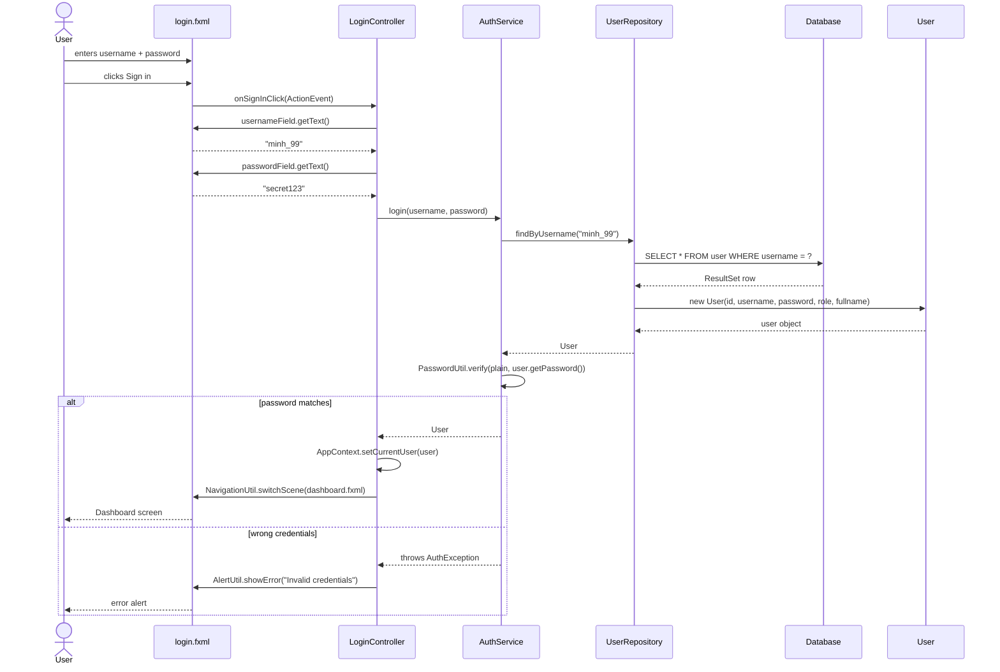

---

## 02 User Register

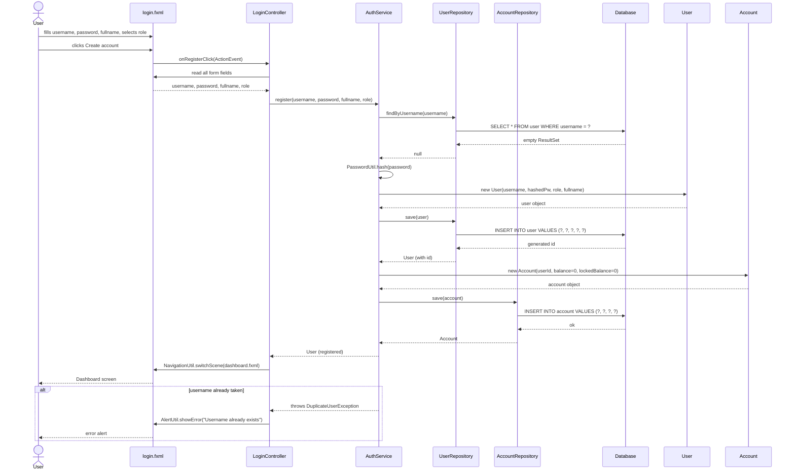

---

## 03 Seller Uploads Item

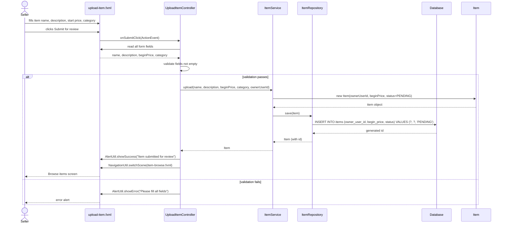

---

## 04 Admin Approves / Rejects Item

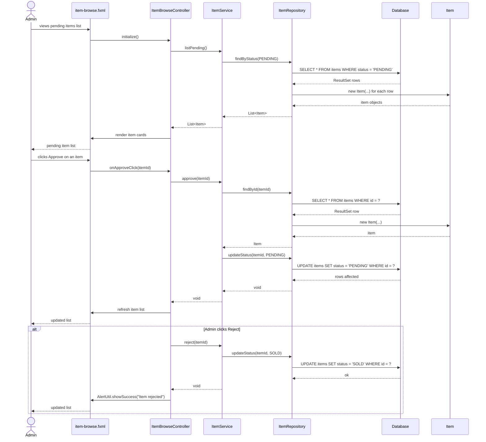

---

## 05 Admin Creates Auction Session

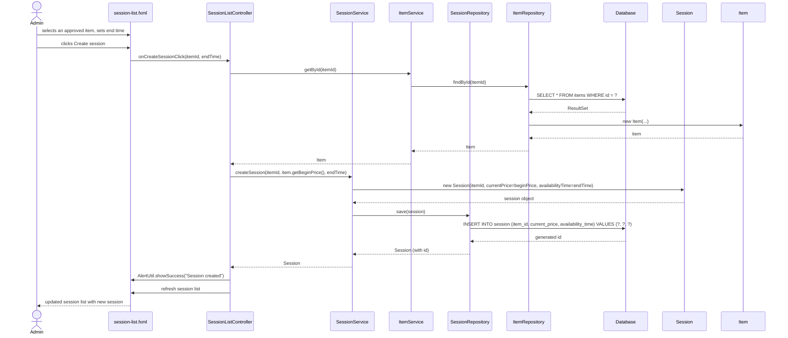

---

## 06 User Joins Session

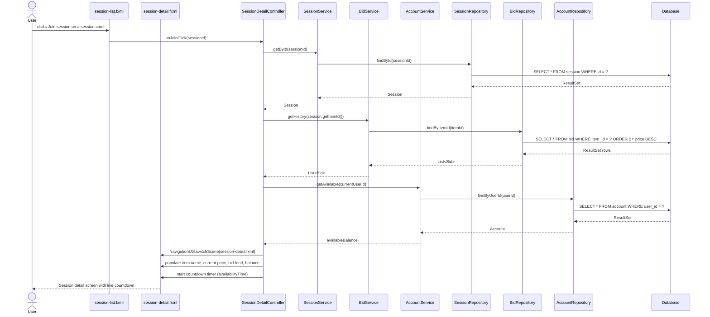

---

## 07 User Places Manual Bid

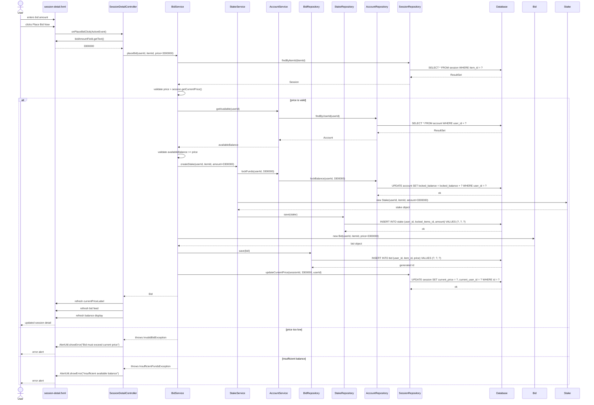

---

## 08 Auto Bid Triggered

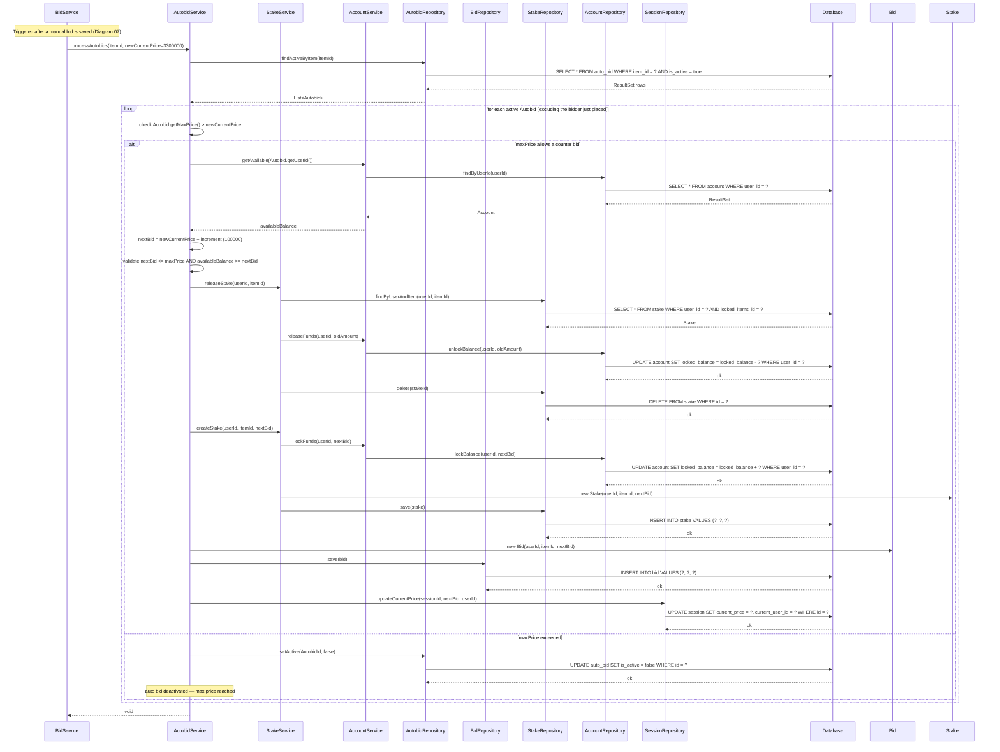

---

## 09 User Configures Auto Bid

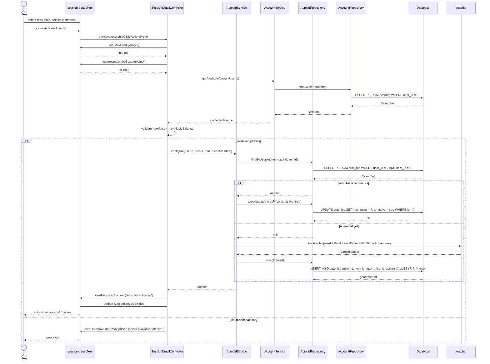

---

## 10 User Deposits Funds

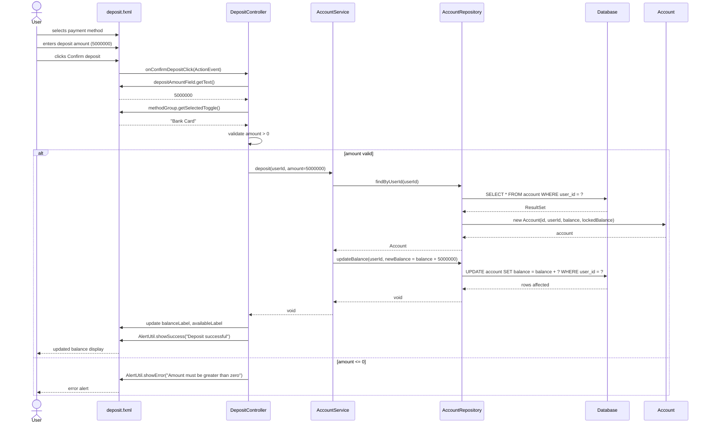

---

## 11 Stake Locked When Bid Placed

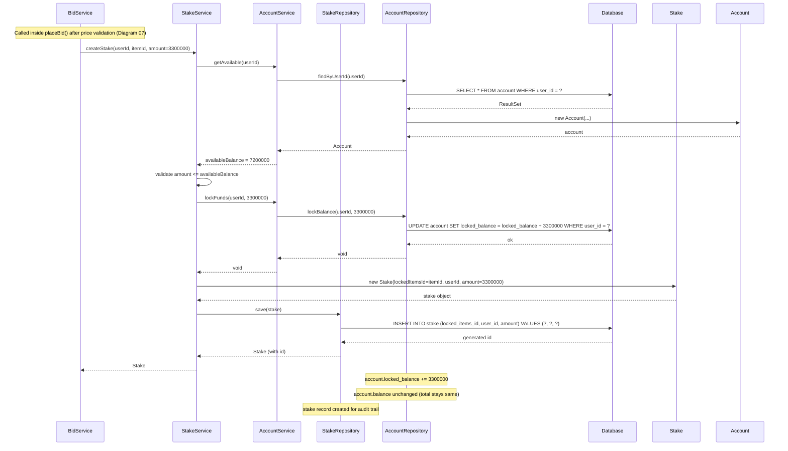

---

## 12 Stake Released When Outbid

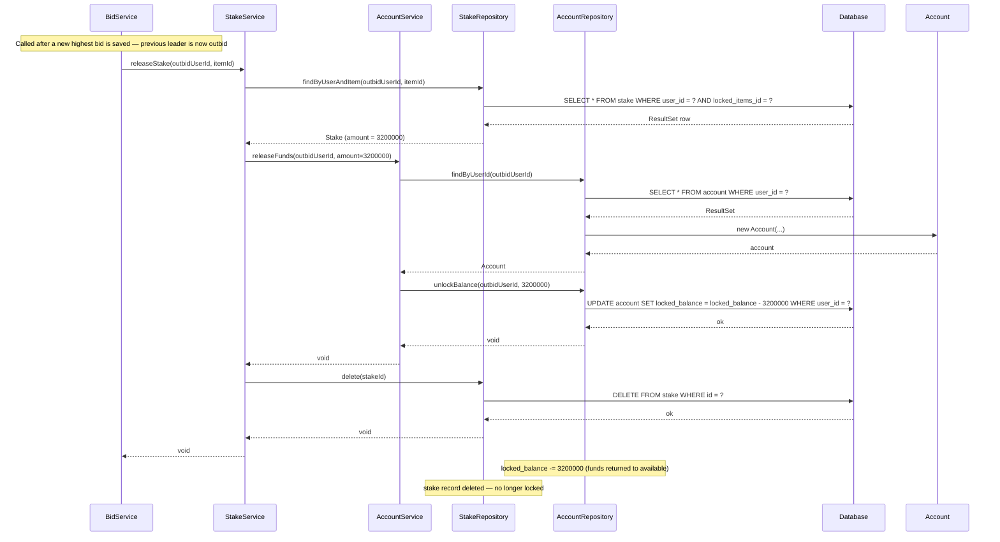

---

## 13 Session Timer Expires — Winner Declared

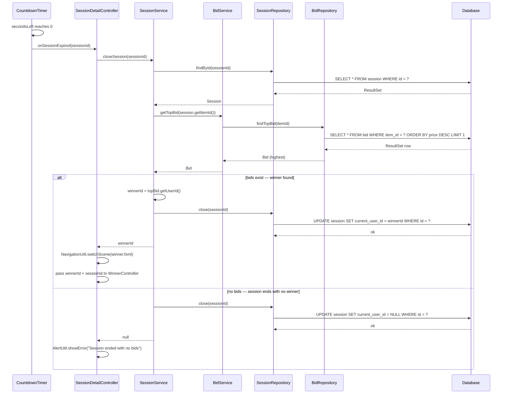

---

## 14 Winner Balance Deducted

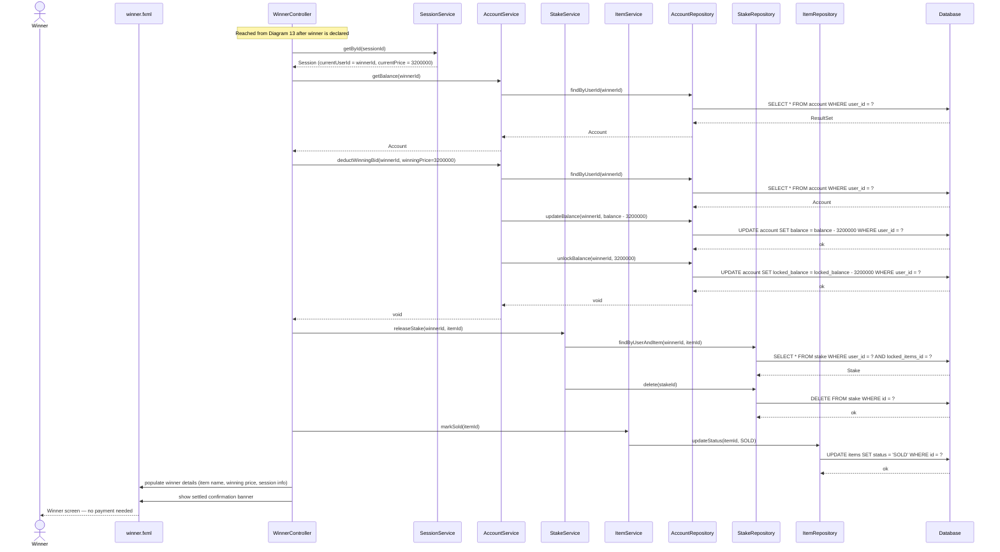

---

## 15 Losing Stakes Released to All Bidders

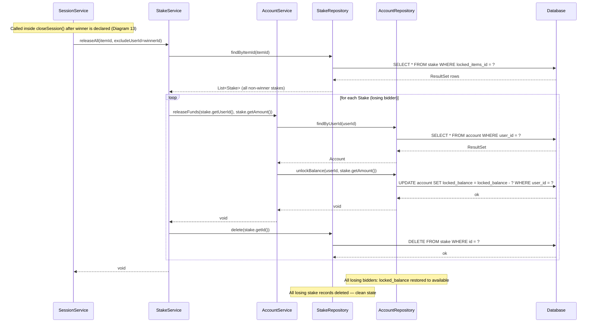

---

## 16 User Views Account Detail

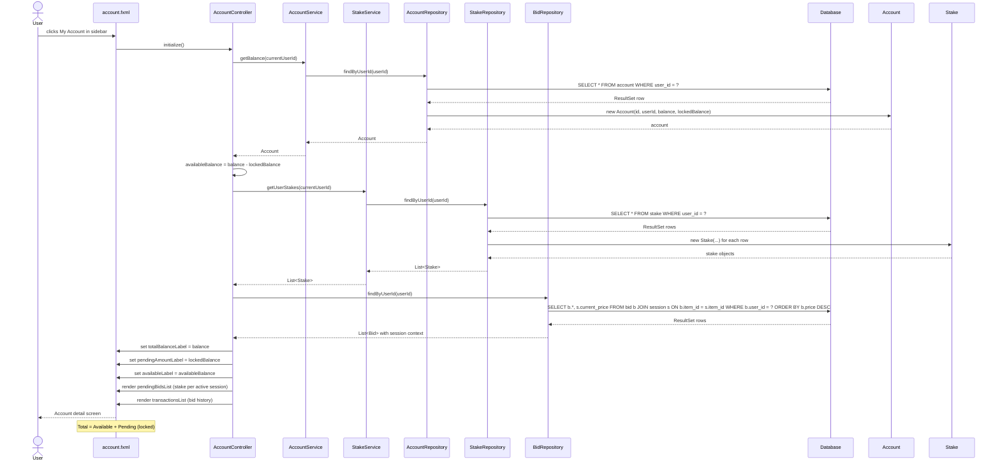

---

*BidNow — JavaFX + JDBC + Maven · 16 Sequence Diagrams*
